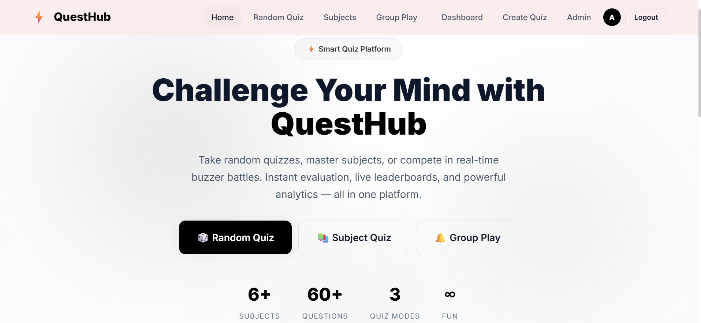
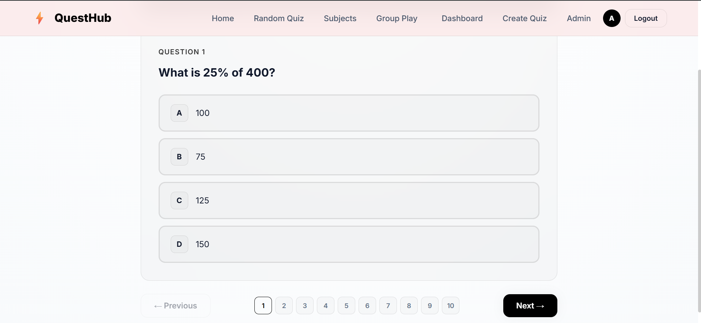
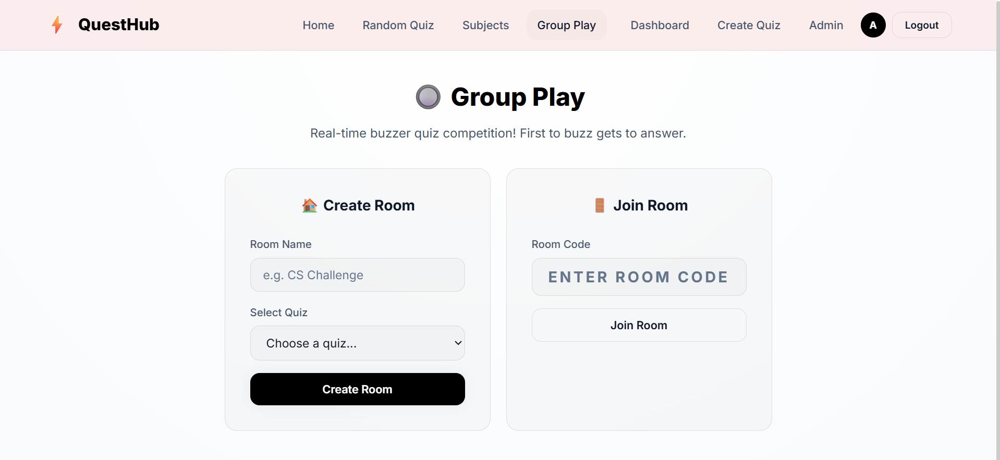
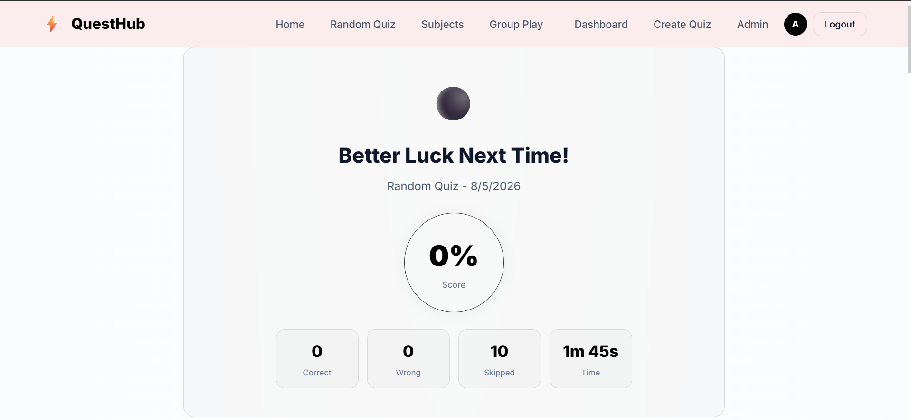
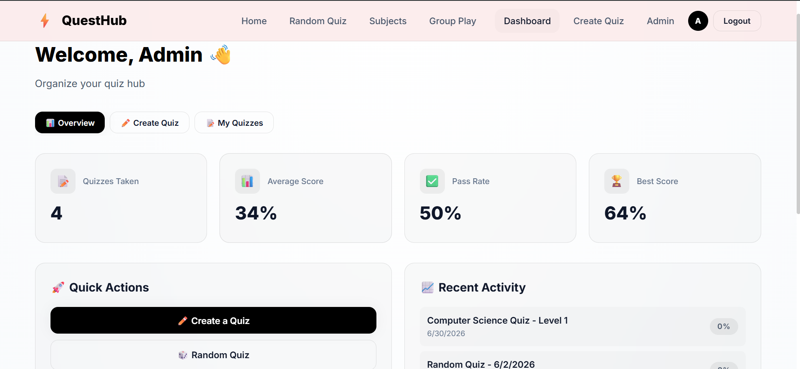

# QuestHub 🎯 - Smart Quiz Platform


A production-grade, full-stack quiz platform built with the MERN stack and Socket.IO. Features three distinct quiz modes including a real-time multiplayer buzzer system with server-side arbitration.

🔗 **Live Demo:** [queshub.netlify.app](https://queshub.netlify.app)

>⚠️ **[IMPORTANT]** Backend is hosted on Render's free tier. First load after inactivity may take **30–50 seconds** to wake up — this is expected behaviour.

---

## ✨ Features

### Three Quiz Modes
- **Random Quiz** - Instant questions drawn from a mixed multi-subject pool
- **Subject-Based Quiz** - Focused practice filtered by academic domain
- **Group Buzzer Mode** - Real-time multiplayer competition where players race to buzz in first

### Core Technical Features
- **Server-side buzzer arbitration** - MongoDB atomic `findOneAndUpdate` eliminates race conditions when multiple players buzz simultaneously
- **Stateless JWT authentication** - Same token validates both REST API requests and Socket.IO WebSocket handshakes
- **Role-based access control** - Admin, Registered User, and Guest tiers with differentiated permissions
- **Analytics dashboard** - Subject-wise performance, difficulty breakdowns, and live leaderboards via MongoDB aggregation pipelines
- **Automated quiz evaluation** - Instant result generation with per-question feedback and explanations

---

## 🛠️ Tech Stack

| Layer | Technology |
|---|---|
| Frontend | React.js 19 (Vite), React Router 7, Axios |
| Real-Time | Socket.IO Client + Server |
| Backend | Node.js, Express.js, REST API |
| Database | MongoDB Atlas, Mongoose ODM |
| Auth | JWT, bcrypt password hashing |
| Charts | Recharts |
| Deployment | Netlify (frontend) + Render (backend) |

---

## 📸 Screenshots

### Home Page


### Quiz Interface


### Buzzer Room


### Results Page


### Analytics Dashboard


---

## 🚀 Getting Started

### Prerequisites
- Node.js v18 or higher
- MongoDB Atlas account (or local MongoDB)
- Git

### 1. Clone the Repository

```bash
git clone https://github.com/FARHANSNC/Questhub.git
cd Questhub
```

### 2. Backend Setup

```bash
cd backend
npm install
```

Create a `.env` file in the `backend/` folder:

```env
NODE_ENV=development
PORT=8080
MONGODB_URL=your_mongodb_atlas_connection_string
JWT_SECRET=your_jwt_secret_key
JWT_EXPIRE=7d
CORS_ORIGIN=http://localhost:5173
PUBLIC_URL=http://localhost:8080
ADMIN_USERNAME=admin
ADMIN_EMAIL=admin@example.com
ADMIN_PASSWORD=your_secure_admin_password
USER1_USERNAME=user1_username
USER1_EMAIL=user1@example.com
USER1_PASSWORD=User1_password
USER1_FULLNAME=fullname_user1
USER2_USERNAME=user2_username
USER2_EMAIL=user2@example.com
USER2_PASSWORD=User2_password
USER2_FULLNAME=fullname_user2
```

Seed the database with demo data (optional but recommended):

```bash
node src/utils/seeder.js
```

Start the backend server:

```bash
npm run dev
```

Backend runs at: `http://localhost:8080`

### 3. Frontend Setup

```bash
cd ../frontend
npm install
```

Create a `.env` file in the `frontend/` folder:

```env
VITE_API_URL=http://localhost:8080/api
VITE_SOCKET_URL=http://localhost:8080
```

Start the frontend dev server:

```bash
npm run dev
```

Frontend runs at: `http://localhost:5173`

---

## 🔐 Demo Credentials
| Role | Email | Password |
|---|---|---|
| User | john@questhub.com | User@123 |
| Guest | No login needed | Browse public quizzes |

> **Note:** Admin access is restricted for security. If you need admin privileges for testing, please contact the author/@me or register a new account and manually assign the admin role in MongoDB Compass.

---

## 📁 Project Structure

```
Questhub/
├── frontend/                  # React.js (Vite) application
│   ├── src/
│   │   ├── pages/             # Route-level page components
│   │   ├── components/        # Reusable UI components
│   │   ├── context/           # AuthContext, SocketContext
│   │   ├── services/          # Axios API instance
│   │   └── main.jsx           # App entry point
│   ├── public/
│   │   └── _redirects         # Netlify SPA routing fix
│   └── .env                   # Frontend environment variables
│
└── backend/                   # Node.js + Express API
    ├── src/
    │   ├── routes/            # API route definitions
    │   ├── models/            # Mongoose schemas
    │   ├── middlewares/       # Auth, error handling
    │   ├── socket/            # Socket.IO event handlers
    │   ├── config/            # DB connection, env config
    │   └── utils/             # Seeder, helpers
    ├── server.js              # Entry point
    └── .env                   # Backend environment variables
```

---

## 🔌 API Overview

| Method | Endpoint | Description | Auth |
|---|---|---|---|
| POST | `/api/auth/register` | Register new user | Public |
| POST | `/api/auth/login` | Login and get JWT | Public |
| GET | `/api/auth/me` | Get current user | Private |
| GET | `/api/subjects` | List all subjects | Public |
| GET | `/api/quizzes` | List all quizzes | Public |
| POST | `/api/quizzes/:id/start` | Start a quiz session | Private |
| POST | `/api/quizzes/:id/submit` | Submit quiz answers | Private |
| POST | `/api/rooms` | Create buzzer room | Private |
| GET | `/api/analytics/leaderboard` | Global leaderboard | Public |

---

## ⚡ Socket.IO Events (Buzzer System)

| Event | Direction | Description |
|---|---|---|
| `join-room` | Client → Server | Join a buzzer room |
| `room-joined` | Server → Client | Confirm join with room state |
| `start-game` | Host → Server | Start the game session |
| `game-started` | Server → All | Broadcast first question |
| `buzzer-press` | Client → Server | Player presses buzzer |
| `buzzer-locked` | Server → All | Announce winner, lock buzzer |
| `submit-answer` | Winner → Server | Winner submits their answer |
| `answer-result` | Server → All | Broadcast result + explanation |
| `score-update` | Server → All | Live leaderboard update |
| `game-ended` | Server → All | Final scores and game stats |

---

## 🚢 Deployment

### Frontend (Netlify)
- Build command: `npm run build`
- Publish directory: `frontend/dist`
- Environment variables set in Netlify dashboard

### Backend (Render)
- Root directory: `backend`
- Start command: `npm start`
- Environment variables set in Render dashboard

### Database (MongoDB Atlas)
- Free M0 cluster
- Network access: `0.0.0.0/0`

---

## 🔮 Future Roadmap

- [ ] AI-powered adaptive difficulty question generation
- [ ] Video proctoring for formal exam sessions
- [ ] Mobile application (React Native)
- [ ] LMS integration (Moodle, Google Classroom)
- [ ] Digital certification on quiz completion
- [ ] Multi-language support (Hindi, Urdu)

---
## 💡 Why This Project?

Built as my BCA final year project, QuestHub bridges the gap between traditional quiz platforms and gamified learning. It combines automated evaluation, real-time competition, and detailed performance tracking into one integrated system. I treated it as a production deployment from day one , not just a localhost project - to learn CORS configuration, environment management, WebSocket stability, and cold-start handling on free-tier hosting.

---
## 👤 Author

**Farhan Ahmad**
- GitHub: [@snicfarhan](https://github.com/snicfarhan)
- LinkedIn: [linkedin.com/in/snicfarhan](https://www.linkedin.com/in/snicfarhan)
- Live Project: [queshub.netlify.app](https://queshub.netlify.app)

BCA Student — Maharaja Suhel Dev State University, Azamgarh

---

## 📄 License

This project is licensed under the MIT License.
